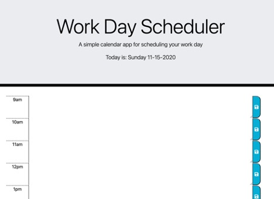

# WorkDayScheduler

Create a Work Day Scheduler that allows the user to input hourly tasks and save them for each day

Installation:

- index.html, script.js, and style.css
- Access from: https://jericfey.github.io/WorkDayScheduler

Summary:

- This is a responsive web page using javascript & jQuery that allows a user to store tasks on a timeline for the day

Usage:

- Type in a task for each hour during the work day to plan events throughout the day

Screenshots:

